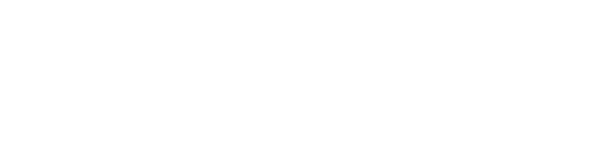

  

<h3 align="center">Welcome! I'm Tigran 👋</h3>

I build backend services and APIs with a focus on async workflows, integrations, and reliable data processing.  
My work spans **game servers**, **bots**, and **systems integration**, including REST/gRPC APIs, message queues, caching, and observability.  
I care about clean architecture, explicit error handling, tests, and maintainable code.

> Most of my production work is private. On my [website](https://tigdav.ru/#portfolio), I share detailed case studies in Russian with screenshots, feature breakdowns, and selected videos.

---

## 🛠️ Tech Stack

**Backend:**

**Data / Messaging / Caching:**

**DevOps / Observability:**

**Testing / Quality:**

**Also worked with:**

---

## ➕ Additional Experience

Production experience with:

**PHP:** [Slim](https://www.slimframework.com/), [Guzzle](https://docs.guzzlephp.org/), [ReactPHP](https://reactphp.org/) ([DiscordPHP](https://github.com/discord-php/DiscordPHP)), [PocketMine-MP](https://pmmp.io/)  
**JavaScript:** [Node.js](https://nodejs.org/) ([discord.js](https://discord.js.org/))  
**Frontend:** [React](https://react.dev/)

---

## 🌐 Links

- ✉️ Email: [x@tigdav.ru](mailto:x@tigdav.ru)
- ✈️ Telegram: [@tigdav](https://t.me/tigdav)
- 🌍 Website (in Russian): [tigdav.ru](https://tigdav.ru)

---

📫 Open to opportunities. Feel free to reach out!
